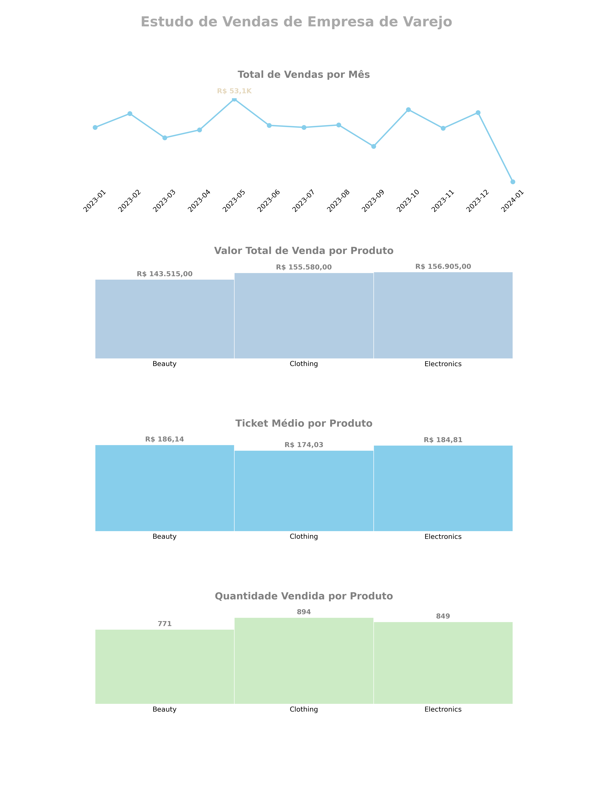

# Visualização de Vendas

Este projeto apresenta um mosaico com o Matplotlib com um retrato do desempenho das vendas de uma empresa de varejo.

## Descrição dos Gráficos

O projeto contém três gráficos principais:

1. **Total de Vendas por Mês**:
   - Valor total das vendas ao longo dos meses
   - O maior valor de vendas é destacado com o rótulo da quantia correspondente
   
2. **Valor Total de Venda por Produto**:
   - Valor total de vendas por categoria de produto
   - As barras são rotuladas com o valor total de vendas para cada categoria

3. **Quantidade Vendida por Produto**:
   - Quantidade de produtos vendidos por categoria
   - As barras são rotuladas com a quantidade correspondente a cada categoria
  
## Tecnologias Utilizadas

- **Python**
- **Bibliotecas**:
  - `matplotlib`
  - `pandas`
  - `cycler`

## Resultado

